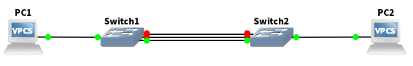
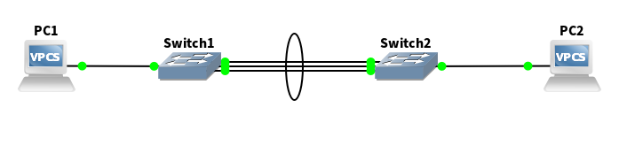
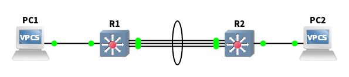

+++
date = '2026-03-02T20:06:18+01:00'
modified = '2026-03-02T20:06:18+01:00'
draft = false
title = 'Ethernet link aggregation - introduction'
tags = []
summary = "This is an introductory post about aggregating physical connections between devices into a single logical connection."
+++

Link aggregation is a term appearing in different areas of networking. It is a general concept of creating a single logical connection between networked devices comprising of many parallel physical connections in order to achieve on or more of the following:
- **increased bandwidth** - ability of sending data at higher rate
- **connection redundancy** - creating a setup that operates without interruption even if some connections fail
- **fault tolerance** - increased tolerance to noise and data integrity corruption
- **load balancing**

Link aggregation was and is realised in information networks like: modem connection on POTS, DSL, PPP, Ethernet, WiFi. This and following posts will concentrate on Ethernet based networks.

Methods of creating such connections are defined in both proprietary and open standards/protocols.

The most widely known proprietary protocol (given long time dominant position of the company which created it) is Cisco's [PAgP](https://en.wikipedia.org/wiki/Port_Aggregation_Protocol). Other standards also exists buy they are rarely referred to by the vendors as protocols.

With the growing demand for network equipment and resulting increased competition today's networks operate on equipment from variety of vendors therefore interoperability is paramount. For this reason and open standard was introduced - the [LACP](https://en.wikipedia.org/wiki/Link_aggregation#Link_Aggregation_Control_Protocol) (Link aggregation Control Protocol) defined in IEEE 802.3ad. Protocol definition was in early 2000s moved, without substantial changes, to a different IEEE task force and obtained a new symbol - IEEE 802.1AX. Since LACP was widely adopted before this move, many vendors keep referring to it as 802.3ad even today.

To muddy the subject further still different vendors advertise this techniques under different trade names for example:
- EtherChannel (Cisco)
- Aggregated Ethernet (Juniper)
- Eth-Trunk (Huawei)
- Bonding (MikroTik, VyOS, Open vSwitch)

The underling concept however is always the same and for all vendors the LACP is at least available and often the default.

## LACP

I am going to give just a brief description of this single protocol since it is an industry standard and write about specifics in later posts.

First let's look at the physical connections themselves. When it comes to routers or multilayer switches a single logical link created with LACP (or other similar protocols) instead of a bunch of separate interfaces is great convenience and offers additional control over how data moves in that connection. Creation of an aggregated group in case of two switches however is absolutely essential. When there is more then one connection between a pair of switches (layer 2 devices) the [STP](https://en.wikipedia.org/wiki/Spanning_Tree_Protocol) kicks in and correctly detecting a loop puts all but one connection in an inactive state. This offers redundancy but any load-balancing or increased throughput is impossible - no matter how many cables we connect between those switches data will flow only through one of them.

Multiple connections between layer 2 switches

When those connections are combined into a single logical link the STP rules are not applied to the individual connections any more but to this new logical one - and since it is now a single connections no loops are present and all members can be in the transmitting state. To differentiate this in network diagrams an ellipse is drawn around grouped connections.

Multiple connections between layer 2 switches forming a **LAG (Link Aggregation Group)**

For layer 3 connection STP is not an issue but we can aggregate those connections as easily.

### The rules

When using LACP some rules apply:
- All member ports must connect to the same system (eg. same switch)
- All ports must be Ethernet and support the same speed and duplex
- Member ports must be in the same VLAN context
	- for untagged aka access ports it means same VLAN
	- tagged aka trunk ports have to carry the same allowed VLANs and native VLAN
- Member ports must use the same link-layer settings (MTU, flow-control, etc.)
- Although the logical link is a convenient abstraction in the end packets have to be send through one of the physical connections. How this is decided can be configured and can depend on combination of:
	- source MAC address
	- destination MAC address
	- source IP address
	- destination IP address
- LACP must be enabled on both ends (in active or passive mode).

The last point is about different modes of LACP configuration:
- active - means that the device will periodically send a special messages across the connection called LACPDUs to inform the neighbor about its member interfaces, their MAC addresses and so on and accepts neighbor's replies with its own settings.
- passive - means a device will not send any LACPDU UNLESS it first receives one from its neigbor. So the device is ready to coordinate the creation of the logical link with its neighbor but will not initiate this process.

### The limits

- The number of connections in a single group is vendor/device specific parameter
- If more interfaces are added to the group they will be put in standby state and use them as backup for failed connections.
- Device exchange LACPDUs even after the link is created to monitor its state and detect failed members. They to that using LACPDUs timers (usually either 1 s or 30 s). A mismatch in settings may result in slow failure detection.

## Training topology

The idea of this series is to show how to configure link aggregation on devices made by different vendors in a homogeneous environments and finally to create a mix of devices from different vendors to see if they can work together without issues.

To facilitate the comparison between vendors our network topology will always be the same for all vendors and will look like this:

This simple network has:
- 2 identical access layer switches
- 1 distribution layer switch
- a router in essentially Router On a Stick configuration
- 4 VLANs: 3 VLANs for regular hosts and 1 for management

Connections are as follows:
- Between switches all connections are formed with LACP and aggregate 2 physical connections on both sides of the connection.
	- The LAG formed is a VLAN trunk aka tagged interface
- Distribution switch an the router connection is also a LACP LAG comprising 3 interfaces on both sides.
	- The LAG is a trunk/tagged interface
	- On the router there are separate layer 3 interfaces for each VLAN created on this LAG

The router is responsible for:
- inter VLAN routing
- DHCP server for all regular VLANs 
- DNS server
- NAT to the internet