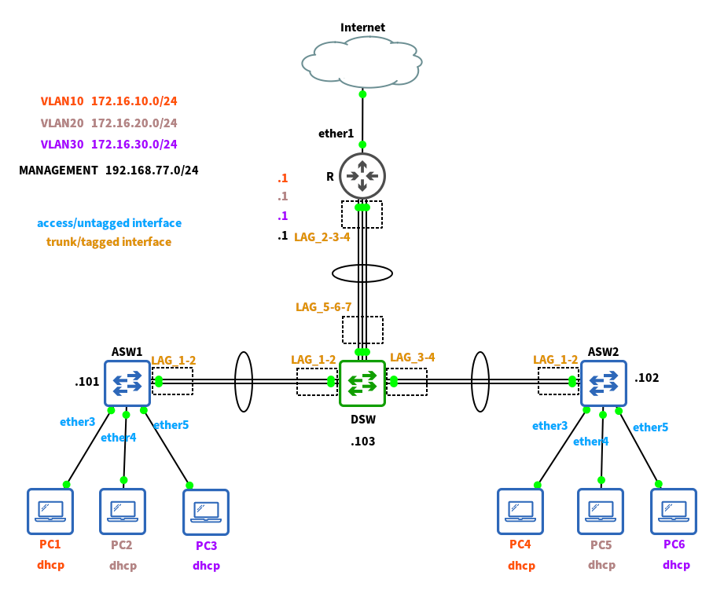
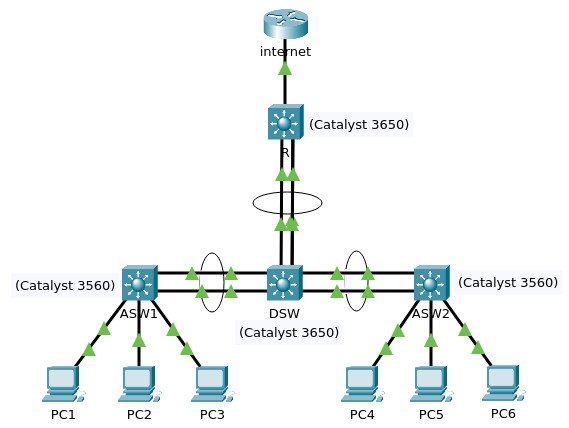

+++
date = '2026-03-09T19:41:01+01:00'
modified = '2026-03-09T19:41:01+01:00'
draft = false
title = 'Link aggregation on Cisco IOS'
tags = ["Cisco"]
summary = "This post is part of series about Ethernet based link aggregation techniques. In this one I am showing how to configure LACP (Link Aggregation Control Protocol) on Cisco devices using IOS."
series = ["Link aggregation"]
series_order = 3
+++

Here is a reminder of the topology we want to end up with.

(LAG stands for Link Aggregation Group, ASWx - access switches, DSW - distribution switch, R - router)

Over the years Cisco's introduced many different devices to the market (some of which don't even use IOS). In contrast to MikroTik products which are, with some exceptions, based on the same operating system, it is hard therefore to pick a representative device(s) and give a universal configuration example. In this exercise I'm going to use Cisco's Packet Tracer (v 8.2.2) to emulate the topology as it has a range of devices to choose from. Unfortunately I found that none of available routers supports protocol based link aggregation, neither LACP nor even PAgP. There are some on which it is possible to define an aggregate interface statically but since it is not the goal of this exercise I decided to use another multilayer switch to act as a router. So the topology will look like this:


(There are 3 connections between DSW and R but for some reason Packet Tracer shows only 2 when device icons are above each other. The internet is emulated with a randomly picked router).

> [!NOTE]
> When turning on the devices for the first time I am declining to use the configuration wizard so the initial configuration is whatever defaults are used for those specific models.

## Capabilities and terminology

In Cisco terminology link aggregation is called "EtherChannel" and in the IOS CLI is configured through a couple of commands in both global and interface only scope.

Generally Cisco offers three ways of configuring an aggregated interface:

- LACP
- PAgP
  - this is Cisco's proprietary protocol, very similar to LACP
- "static" - when this is set aggregated interface is created without any checks. Member interfaces will not send any messages to the neighbor device with their configuration nor will they interpret messages incoming from the neighbor. This is a very manual and not recommended method.
  **None** of these methods **is default** as the choice has to always be explicit.

The concrete interface that a packet uses when traversing a LAG is decided by a combination of packet's source and destination addresses. The exact policy is configured **device wide** (and is shared by both LACP and PAgP) using the `port-channel load-balance` command in the global config mode. The most common options available are rather self explanatory, these are:
- src-mac - this is the default for the devices used in this lab
- dst-mac
- src-dst-mac
- src-ip

- dst-ip
  - src-dst-ip

> [!NOTE]
> It is worth noting that modern devices, especially those equipped with ASICs, can and do offer other options including those involving line speed packet analysis beyond layer 3 and so it is always a good idea to check the docs.

## Configuration

To accomplish the task for the switches we basically need to:

- group required interfaces using LACP into a LAG, and define load balancing policy
- turn the LAG interfaces into VLAN trunks (also create access ports where needed)
- set up virtual layer 3 management interfaces (give them IP address and define their default gateway)

For the router we need to:

- repeat almost the same configuration to create LAG as for the switches
- additionally set up a DHCP server for all three VLANs

As with the other vendors let's start with access switches.

### Access switches 1 and 2

I chose series 3560 multilayer switches for the ASW1 and ASW2. They have identical roles in the topology and with the exception of the management LAN IP address and hostname the configuration is the same.

1. We enter configuration mode and set up device name:

```
enable
configure terminal

hostname ASW1
```

2. To match other examples in this series we will first set the global load-balancing policy for aggregated interfaces to use combination of source and destinations MAC addresses:

```
port-channel load-balance src-dst-mac
```

3. To create the LAG made of 1st and 2nd gigabit Ethernet ports we enter their configuration mode with the range command:

```
interface range g0/1-2
```

4. The next step is very Cisco specific. On Cisco devices the Dynamic Trunking Protocol (DTP) is enabled by default on all interfaces. This feature serves to negotiate handling of VLAN labelled frames between connected devices. We want our LAG to also become trunk but the nature of DTP makes it possible for malicious actor to alter the topology of the network and thus DTP is often considered to be a security risk (in many cases this would be true especially for the access switches). It is also Cisco's proprietary protocol which makes it not very useful in heterogeneous networks. DTP may also affect formation of the LAG itself. So first we want to turn it off using the `switchport nonegotiate` command. On older switches however this will lead to an error message. This is because those devices support two VLAN tagging protocols: the modern, industry standard IEEE 802.1q and old Cisco's ISL. They are also configured to negotiate the choice of this protocol with the neighbor via... DTP!. To untangle this dependency we need to first specify what tagging protocol to use (we obviously chose 802.1q), then make the interface be a trunk and finally we turn DTP off:

```
 switchport trunk encapsulation dot1q
 switchport mode trunk
 switchport nonegotiate
```

5. We can at last define our LAG using LACP. This new logical interface is created with the `channel-group` command followed by unique number the interface should have (in case there is more then one). In IOS we can't name the interfaces using string values like e.g. in RouterOS (in the other post this interface was given a name "LAG_1-2"). At this point we also must chose the protocol that is used the create this LAG (mode must be specified, there is no default). Keywords `active` and `passive` tell that aggregate should be formed using LACP. Other options are "auto" and "desirable" if we wanted PAgP (we don't) or "on" to create the "static" EtherChannel mentioned at the beginning. To be on the save side we switch interfaces off and then on to correctly apply the settings (we are still in the interface range scope):

```
 shutdown
 channel-group 1 mode active
 no shutdown
```

6. At this point our LAG interface was created (and with the command `show ip interface brief` we can check this is the case), so we switch over to its configuration and define it as a trunk interface with DTP off in the exactly same way we did for its constituent physical interfaces. We also specify which VLANs should be allowed through:

```
interface port-channel 1
 switchport trunk encapsulation dot1q
 switchport mode trunk
 switchport nonegotiate
 switchport trunk allowed vlan 10,20,30,77
 no shutdown
```

> [!NOTE]
> In Cisco terms the interface aggregation technique is called EtherChannel and this word is used in some commands displaying status and configuration details. As can be seen above two other terms are used as well:
>
> - `channel-group` - is the name of the command that creates the aggregated interface (LAG) - quite unintuitively given the etherchannel term used elsewhere.
> - `port-channel` - is yet another name, it denotes the type of such interface (e.g. in MikroTik's RouterOS this type is called "bonding interface" or simply "bond") but it is also used as a command name when choosing load-balancing policy!

7. To complete VLANs configuration let's set up three access interfaces for the hosts. The `switchport mode access` command has the side effect of automatically deactivating DTP on the port so no `switchport nonegotiate` is required. BTW I am using f0/3, 4, and 5, even though f0/1 and f0/2 are also free. This is only for the sake of keeping interface numbering somehow consistent with other posts in the series. We configure ports one by one because each interface is in a different VLAN.

```
interface range f0/3
 switchport mode access
 switchport access vlan 10
 no shutdown
interface range f0/4
 switchport mode access
 switchport access vlan 20
 no shutdown
interface range f0/5
 switchport mode access
 switchport access vlan 30
 no shutdown
```

> [!TIP]
> Creating first access port for a new VLAN creates a MAC address table for that VLAN effectively enabling the switching process. The creation of this table is often colloquially (and somehow incorrectly) referred to as "creating VLAN".

8. To access this switch from other devices in the network for management purposes via IP based protocols like telnet or ssh we need a L3 interface with an IP address. To do that we first need to enable ip routing functionality on the device, turning it from L2 switch to a L3 switch. (If we are in the interface config mode we need to go back to global config mode first by a single `exit` command).

```
ip routing
```

9. Still in in the global config mode we begin by defining the default gateway. To do this we add an entry to the routing table (which BTW started to exist in the previous step). Since the management LAN will not use any DHCP server we may also want to manually set the address of the DNS server:

```
ip route 0.0.0.0 0.0.0.0 192.168.77.1

ip name-server 8.8.8.8
```

10. Now we will use the so called SVI (Switch Virtual Interface) to create the needed L3 interface. We will put it in the VLAN 77 and assign an IP address and mask as per requirements for this training lab. **WARNING** this address must be different on ASW1 (.101) and ASW2 (.102) - make changes accordingly.

```
interface vlan 77
 ip address 192.168.77.101 255.255.255.0
 no shutdown
```

11. In contrast to physical interfaces configured as access ports for VLANs 10,20 and 30 **creating an SVI does not create a MAC address table** and so our interface won't be reachable. To fix this we need to **manually create** this **table** for VLAN 77 from the global config mode:

```
vlan 77
```

### Distribution switch

At this point the following steps for the distribution switch should be easy to understand. There are two things worth noting. First, because the DSW is a newer series 3650 device which dropped support for the ISL, the command `switchport trunk encapsulation dot1q` is not needed. Secondly, we have to explicitly create MAC address tables for all VLANs since on this switch we will not create any access ports, just three LAG interfaces. So with that here are the required commands:

```
enable
configure terminal

hostname DSW

port-channel load-balance src-dst-mac

interface range g1/0/1-g1/0/2
 switchport mode trunk
 switchport nonegotiate
 shutdown
 channel-group 1 mode active
 no shutdown

interface port-channel 1
 switchport mode trunk
 switchport nonegotiate
 switchport trunk allowed vlan 10,20,30,77

interface range g1/0/3-g1/0/4
 switchport mode trunk
 switchport nonegotiate
 shutdown
 channel-group 2 mode active
 no shutdown

interface port-channel 2
 switchport mode trunk
 switchport nonegotiate
 switchport trunk allowed vlan 10,20,30,77

interface range g1/0/5-g1/0/7
 switchport mode trunk
 switchport nonegotiate
 shutdown
 channel-group 3 mode active
 no shutdown

interface port-channel 3
 switchport mode trunk
 switchport nonegotiate
 switchport trunk allowed vlan 10,20,30,77

 vlan 10
 vlan 20
 vlan 30
 vlan 77

ip routing

ip route 0.0.0.0 0.0.0.0 192.168.77.1

ip name-server 8.8.8.8

interface vlan 77
 ip address 192.168.77.103 255.255.255.0
 no shutdown
```

### Router

Just like for the DSW I chose series 3650 multilayer switch to be the basis for the router.

1. There is only one LAG interface here and we create and configure it the same way as on other devices:

```
enable
configure terminal

hostname R

port-channel load-balance src-dst-mac

interface range g1/0/2-g1/0/4
 switchport mode trunk
 switchport nonegotiate
 shutdown
 channel-group 1 mode active
 no shutdown

interface port-channel 1
 switchport mode trunk
 switchport nonegotiate
 switchport trunk allowed vlan 10,20,30,77
```

2. There are also no access ports on the router so we need to manually cause the MAC address tables to be created for all VLANs:

```
 vlan 10
 vlan 20
 vlan 30
 vlan 77
```

3. Now we have to create L3 interfaces that will be the default gateways for all four VLANs. We again enable routing capabilities and use the SVIs:

```
ip routing

interface vlan 10
 ip address 172.16.10.1 255.255.255.0
 no shutdown
interface vlan 20
 ip address 172.16.20.1 255.255.255.0
 no shutdown
interface vlan 30
 ip address 172.16.30.1 255.255.255.0
 no shutdown
interface vlan 77
 ip address 192.168.77.1 255.255.255.0
 no shutdown
```

4. If at this point we decide to configure static IP addresses on hosts connected to the access switches that would be all we needed to do. But to fulfil the requirement for this training lab we want to create a DHCP server on the router for the regular three VLANs (the management network has static configuration). We do that by creating address pools for each subnet and (optionally) limiting the range of addresses that can be assigned. We also specify what DNS server should be used in each subnet:

```
ip dhcp excluded-address 172.16.10.1 172.16.10.99
ip dhcp excluded-address 172.16.10.201 172.16.10.254
ip dhcp pool VLAN10_POOL
 network 172.16.10.0 255.255.255.0
 default-router 172.16.10.1
 dns-server 8.8.8.8

ip dhcp excluded-address 172.16.20.1 172.16.20.99
ip dhcp excluded-address 172.16.20.201 172.16.20.254
ip dhcp pool VLAN20_POOL
 network 172.16.20.0 255.255.255.0
 default-router 172.16.20.1
 dns-server 8.8.8.8

ip dhcp excluded-address 172.16.30.1 172.16.30.99
ip dhcp excluded-address 172.16.30.201 172.16.30.254
ip dhcp pool VLAN30_POOL
 network 172.16.30.0 255.255.255.0
 default-router 172.16.30.1
 dns-server 8.8.8.8
```

5. Finally we can set up a DHCP client on the interface connected to the outside network so it will get its configuration automatically:

```
 interface g1/0/1
  no switchport
  ip address dhcp
```

Let's now check whether everything works as expected.

## Configuration check-up and monitoring

To check if LAG aka bonding interfaces were created we can print the list of all interfaces (here on ASW1):

```
ASW1#show ip interface brief

Interface IP-Address OK? Method Status Protocol
Port-channel1 unassigned YES unset up up
FastEthernet0/1 unassigned YES unset down down
FastEthernet0/2 unassigned YES unset down down
FastEthernet0/3 unassigned YES unset up up
FastEthernet0/4 unassigned YES unset up up
FastEthernet0/5 unassigned YES unset up up
FastEthernet0/6 unassigned YES unset down down
FastEthernet0/7 unassigned YES unset down down
FastEthernet0/8 unassigned YES unset down down
FastEthernet0/9 unassigned YES unset down down
FastEthernet0/10 unassigned YES unset down down
FastEthernet0/11 unassigned YES unset down down
FastEthernet0/12 unassigned YES unset down down
FastEthernet0/13 unassigned YES unset down down
FastEthernet0/14 unassigned YES unset down down
FastEthernet0/15 unassigned YES unset down down
FastEthernet0/16 unassigned YES unset down down
FastEthernet0/17 unassigned YES unset down down
FastEthernet0/18 unassigned YES unset down down
FastEthernet0/19 unassigned YES unset down down
FastEthernet0/20 unassigned YES unset down down
FastEthernet0/21 unassigned YES unset down down
FastEthernet0/22 unassigned YES unset down down
FastEthernet0/23 unassigned YES unset down down
FastEthernet0/24 unassigned YES unset down down
GigabitEthernet0/1 unassigned YES unset up up
GigabitEthernet0/2 unassigned YES unset up up
Vlan1 unassigned YES unset administratively down down
Vlan77 192.168.77.101 YES manual up up
```

To check what load balancing policy is in effect we do:

```
ASW1# show etherchannel load-balance

EtherChannel Load-Balancing Configuration:
src-dst-mac

EtherChannel Load-Balancing Addresses Used Per-Protocol:
Non-IP: Source XOR Destination MAC address
IPv4: Source XOR Destination MAC address
IPv6: Source XOR Destination MAC address
```

To see the summary of all configured LAG interfaces we can do:

```
DSW# show etherchannel summary

Flags: D - down P - in port-channel
I - stand-alone s - suspended
H - Hot-standby (LACP only)
R - Layer3 S - Layer2
U - in use f - failed to allocate aggregator
u - unsuitable for bundling
w - waiting to be aggregated
d - default port

Number of channel-groups in use: 3
Number of aggregators: 3

Group Port-channel Protocol Ports
------+-------------+-----------+----------------------------------------------
1 Po1(SU) LACP Gig1/0/1(P) Gig1/0/2(P)
2 Po2(SU) LACP Gig1/0/3(P) Gig1/0/4(P)
3 Po3(SU) LACP Gig1/0/5(P) Gig1/0/6(P) Gig1/0/7(P)
```

Let me now disrupt the connection between the router and the distribution switch by removing one of the cables. On DSW I can see this log message:

```
%LINEPROTO-5-UPDOWN: Line protocol on Interface GigabitEthernet1/0/5, changed state to down
```

Let's see the **details** of all LAG interfaces on DSW

```
DSW# show etherchannel port-channel

Channel-group listing:
----------------------

Group: 1
----------
Port-channels in the group:
---------------------------
Port-channel: Po1 (Primary Aggregator)
------------

Age of the Port-channel = 00d:03h:40m:41s
Logical slot/port = 2/1 Number of ports = 2
GC = 0x00000000 HotStandBy port = null
Port state = Port-channel
Protocol = LACP
Port Security = Disabled

Ports in the Port-channel:

Index Load Port EC state No of bits
------+------+------+------------------+-----------
0 00 Gig1/0/1 Active 0
0 00 Gig1/0/2 Active 0
Time since last port bundled: 00d:03h:40m:41s Gig1/0/2


Group: 2
----------
Port-channels in the group:
---------------------------
Port-channel: Po2 (Primary Aggregator)
------------

Age of the Port-channel = 00d:03h:40m:41s
Logical slot/port = 2/2 Number of ports = 2
GC = 0x00000000 HotStandBy port = null
Port state = Port-channel
Protocol = LACP
Port Security = Disabled

Ports in the Port-channel:

Index Load Port EC state No of bits
------+------+------+------------------+-----------
0 00 Gig1/0/3 Active 0
0 00 Gig1/0/4 Active 0
Time since last port bundled: 00d:03h:40m:41s Gig1/0/4

Group: 3
----------
Port-channels in the group:
---------------------------
Port-channel: Po3 (Primary Aggregator)
------------

Age of the Port-channel = 00d:03h:40m:41s
Logical slot/port = 2/3 Number of ports = 2
GC = 0x00000000 HotStandBy port = null
Port state = Port-channel
Protocol = LACP
Port Security = Disabled

Ports in the Port-channel:

Index Load Port EC state No of bits
------+------+------+------------------+-----------
0 00 Gig1/0/6 Active 0
0 00 Gig1/0/7 Active 0
Time since last port bundled: 00d:00h:03m:26s Gig1/0/7
```

As can be seen all LAGs use the LACP protocol. LAG 1 and 2 are operating using 2 member interfaces as expected but LAG 3 now only has 2 interfaces present and active (of 3 configured). Upon reconnecting the cable the Po3 interface shows:

```
Group: 3
----------
Port-channels in the group:
---------------------------
Port-channel: Po3 (Primary Aggregator)
------------

Age of the Port-channel = 00d:03h:46m:48s
Logical slot/port = 2/3 Number of ports = 3
GC = 0x00000000 HotStandBy port = null
Port state = Port-channel
Protocol = LACP
Port Security = Disabled

Ports in the Port-channel:

Index Load Port EC state No of bits
------+------+------+------------------+-----------
0 00 Gig1/0/6 Active 0
0 00 Gig1/0/7 Active 0
0 00 Gig1/0/5 Active 0
Time since last port bundled: 00d:00h:01m:05s Gig1/0/5
```

We can also get some more details by inspecting the information about the interface itself:

```
DSW#show interfaces Po3

Port-channel3 is up, line protocol is up (connected)
Hardware is EtherChannel, address is 000b.be7d.680b (bia 000b.be7d.680b)
MTU 1500 bytes, BW 3000000 Kbit, DLY 1000 usec,
reliability 255/255, txload 1/255, rxload 1/255
Encapsulation ARPA, loopback not set
Keepalive set (10 sec)
Half-duplex, 3000Mb/s
input flow-control is off, output flow-control is off
Members in this channel: Gig1/0/5 ,Gig1/0/6 ,Gig1/0/7 ,
ARP type: ARPA, ARP Timeout 04:00:00
Last input 00:00:08, output 00:00:05, output hang never
Last clearing of "show interface" counters never
Input queue: 0/75/0/0 (size/max/drops/flushes); Total output drops: 0
Queueing strategy: fifo
Output queue :0/40 (size/max)
5 minute input rate 0 bits/sec, 0 packets/sec
5 minute output rate 0 bits/sec, 0 packets/sec
956 packets input, 193351 bytes, 0 no buffer
Received 956 broadcasts, 0 runts, 0 giants, 0 throttles
0 input errors, 0 CRC, 0 frame, 0 overrun, 0 ignored, 0 abort
0 watchdog, 0 multicast, 0 pause input
0 input packets with dribble condition detected
2357 packets output, 263570 bytes, 0 underruns
0 output errors, 0 collisions, 10 interface resets
0 babbles, 0 late collision, 0 deferred
0 lost carrier, 0 no carrier
0 output buffer failures, 0 output buffers swapped out
```

> [!NOTE]
> I'm not sure whether this is a Packet Tracer limitation/bug but the information above seems to suggest the interface is in half-duplex mode. This is strange because all member interfaces claim to operate in full-duplex mode e.g.:
>
> ```
> DSW# show interfaces g1/0/5 | include duplex
> Full-duplex, 1000Mb/s
> ```
>
> Also LACP specification mandates full-duplex operation for all member interfaces and it would be strange for the resulting aggregated interface to become half-duplex connection.
>
> This may be a result of switching DTP off thou. Unfortunately trying to force full duplex operation on the LAGs by switching to their configuration mode and using duplex command results in a very strange error:
>
> ```
> DSW(config)#interface po3
> DSW(config-if)#duplex full
>
> %Command not available for fiber interfaces.
>
> ```
>
> Again this may be Packet Tracer issue as we are definitely not using fibre interfaces here.

We can also confirm that the LAG interfaces are indeed VLAN trunks:

```
DSW#show interfaces trunk

Port Mode Encapsulation Status Native vlan
Po1 on 802.1q trunking 1
Po2 on 802.1q trunking 1
Po3 on 802.1q trunking 1

Port Vlans allowed on trunk
Po1 10,20,30,77
Po2 10,20,30,77
Po3 10,20,30,77

Port Vlans allowed and active in management domain
Po1 10,20,30,77
Po2 10,20,30,77
Po3 10,20,30,77

Port Vlans in spanning tree forwarding state and not pruned
Po1 10,20,30,77
Po2 10,20,30,77
Po3 10,20,30,77
```

Finally we can turn on our client PCs and test whether they can ping each other. As an example we see pings going through from PC1 in VLAN10 to PC4 in the same VLAN and to PC6 in VLAN30 :

```
C:\>ipconfig

FastEthernet0 Connection:(default port)
Connection-specific DNS Suffix..:
Link-local IPv6 Address.........: FE80::240:BFF:FEE3:18C
IPv6 Address....................: ::
IPv4 Address....................: 172.16.10.100
Subnet Mask.....................: 255.255.255.0
Default Gateway.................: ::
                                  172.16.10.1

C:\>ping 172.16.10.101

Pinging 172.16.10.101 with 32 bytes of data:
Reply from 172.16.10.101: bytes=32 time<1ms TTL=128

C:\>ping 172.16.30.101

Pinging 172.16.30.101 with 32 bytes of data:
Reply from 172.16.30.101: bytes=32 time<1ms TTL=127
```

## Complete running-configs

For the sake of completeness here is the output of `show running-config` for all devices.

```
Building configuration...

Current configuration : 1956 bytes
!
version 12.2(37)SE1
no service timestamps log datetime msec
no service timestamps debug datetime msec
no service password-encryption
!
hostname ASW1
!
!
!
!
!
!
ip routing
!
!
!
!
!
!
!
!
!
!
!
!
!
ip name-server 8.8.8.8
!
!
port-channel load-balance src-dst-mac
spanning-tree mode pvst
!
!
!
!
!
!
interface Port-channel1
 switchport trunk allowed vlan 10,20,30,77
 switchport trunk encapsulation dot1q
 switchport mode trunk
 switchport nonegotiate
!
interface FastEthernet0/1
!
interface FastEthernet0/2
!
interface FastEthernet0/3
 switchport access vlan 10
 switchport mode access
!
interface FastEthernet0/4
 switchport access vlan 20
 switchport mode access
!
interface FastEthernet0/5
 switchport access vlan 30
 switchport mode access
!
interface FastEthernet0/6
!
interface FastEthernet0/7
!
interface FastEthernet0/8
!
interface FastEthernet0/9
!
interface FastEthernet0/10
!
interface FastEthernet0/11
!
interface FastEthernet0/12
!
interface FastEthernet0/13
!
interface FastEthernet0/14
!
interface FastEthernet0/15
!
interface FastEthernet0/16
!
interface FastEthernet0/17
!
interface FastEthernet0/18
!
interface FastEthernet0/19
!
interface FastEthernet0/20
!
interface FastEthernet0/21
!
interface FastEthernet0/22
!
interface FastEthernet0/23
!
interface FastEthernet0/24
!
interface GigabitEthernet0/1
 switchport trunk allowed vlan 10,20,30,77
 switchport trunk encapsulation dot1q
 switchport mode trunk
 switchport nonegotiate
 channel-group 1 mode active
!
interface GigabitEthernet0/2
 switchport trunk allowed vlan 10,20,30,77
 switchport trunk encapsulation dot1q
 switchport mode trunk
 switchport nonegotiate
 channel-group 1 mode active
!
interface Vlan1
 no ip address
 shutdown
!
interface Vlan77
 mac-address 0060.4791.ae01
 ip address 192.168.77.101 255.255.255.0
!
ip classless
ip route 0.0.0.0 0.0.0.0 192.168.77.1
!
ip flow-export version 9
!
!
!
!
!
!
!
!
line con 0
!
line aux 0
!
line vty 0 4
 login
!
!
!
!
end
```

```
Building configuration...

Current configuration : 1928 bytes
!
version 12.2(37)SE1
no service timestamps log datetime msec
no service timestamps debug datetime msec
no service password-encryption
!
hostname ASW2
!
!
!
!
!
!
ip routing
!
!
!
!
!
!
!
!
!
!
!
!
!
ip name-server 8.8.8.8
!
!
port-channel load-balance src-dst-mac
spanning-tree mode pvst
!
!
!
!
!
!
interface Port-channel1
 switchport trunk allowed vlan 10,20,30,77
 switchport trunk encapsulation dot1q
 switchport mode trunk
 switchport nonegotiate
!
interface FastEthernet0/1
!
interface FastEthernet0/2
!
interface FastEthernet0/3
 switchport access vlan 10
 switchport mode access
!
interface FastEthernet0/4
 switchport access vlan 20
 switchport mode access
!
interface FastEthernet0/5
 switchport access vlan 30
 switchport mode access
!
interface FastEthernet0/6
!
interface FastEthernet0/7
!
interface FastEthernet0/8
!
interface FastEthernet0/9
!
interface FastEthernet0/10
!
interface FastEthernet0/11
!
interface FastEthernet0/12
!
interface FastEthernet0/13
!
interface FastEthernet0/14
!
interface FastEthernet0/15
!
interface FastEthernet0/16
!
interface FastEthernet0/17
!
interface FastEthernet0/18
!
interface FastEthernet0/19
!
interface FastEthernet0/20
!
interface FastEthernet0/21
!
interface FastEthernet0/22
!
interface FastEthernet0/23
!
interface FastEthernet0/24
!
interface GigabitEthernet0/1
 switchport trunk allowed vlan 10,20,30,77
 switchport trunk encapsulation dot1q
 switchport mode trunk
 switchport nonegotiate
 channel-group 1 mode active
!
interface GigabitEthernet0/2
 switchport trunk allowed vlan 10,20,30,77
 switchport trunk encapsulation dot1q
 switchport mode trunk
 switchport nonegotiate
 channel-group 1 mode active
!
interface Vlan1
 no ip address
 shutdown
!
interface Vlan77
 ip address 192.168.77.102 255.255.255.0
!
ip classless
ip route 0.0.0.0 0.0.0.0 192.168.77.1
!
ip flow-export version 9
!
!
!
!
!
!
!
!
line con 0
!
line aux 0
!
line vty 0 4
login
!
!
!
!
end
```

```
Building configuration...

Current configuration : 2722 bytes
!
version 16.3.2
no service timestamps log datetime msec
no service timestamps debug datetime msec
no service password-encryption
!
hostname DSW
!
!
!
!
!
!
!
no ip cef
ip routing
!
no ipv6 cef
!
!
!
!
!
!
!
!
!
!
!
!
ip name-server 8.8.8.8
!
!
port-channel load-balance src-dst-mac
spanning-tree mode pvst
!
!
!
!
!
!
interface Port-channel1
 switchport trunk allowed vlan 10,20,30,77
 switchport mode trunk
 switchport nonegotiate
!
interface Port-channel2
 switchport trunk allowed vlan 10,20,30,77
 switchport mode trunk
 switchport nonegotiate
!
interface Port-channel3
 switchport trunk allowed vlan 10,20,30,77
 switchport mode trunk
 switchport nonegotiate
!
interface GigabitEthernet1/0/1
 switchport trunk allowed vlan 10,20,30,77
 switchport mode trunk
 switchport nonegotiate
 channel-group 1 mode active
!
interface GigabitEthernet1/0/2
 switchport trunk allowed vlan 10,20,30,77
 switchport mode trunk
 switchport nonegotiate
 channel-group 1 mode active
!
interface GigabitEthernet1/0/3
 switchport trunk allowed vlan 10,20,30,77
 switchport mode trunk
 switchport nonegotiate
 channel-group 2 mode active
!
interface GigabitEthernet1/0/4
 switchport trunk allowed vlan 10,20,30,77
 switchport mode trunk
 switchport nonegotiate
 channel-group 2 mode active
!
interface GigabitEthernet1/0/5
 switchport trunk allowed vlan 10,20,30,77
 switchport mode trunk
 switchport nonegotiate
 channel-group 3 mode active
!
interface GigabitEthernet1/0/6
 switchport trunk allowed vlan 10,20,30,77
 switchport mode trunk
 switchport nonegotiate
 channel-group 3 mode active
!
interface GigabitEthernet1/0/7
 switchport trunk allowed vlan 10,20,30,77
 switchport mode trunk
 switchport nonegotiate
 channel-group 3 mode active
!
interface GigabitEthernet1/0/8
!
interface GigabitEthernet1/0/9
!
interface GigabitEthernet1/0/10
!
interface GigabitEthernet1/0/11
!
interface GigabitEthernet1/0/12
!
interface GigabitEthernet1/0/13
!
interface GigabitEthernet1/0/14
!
interface GigabitEthernet1/0/15
!
interface GigabitEthernet1/0/16
!
interface GigabitEthernet1/0/17
!
interface GigabitEthernet1/0/18
!
interface GigabitEthernet1/0/19
!
interface GigabitEthernet1/0/20
!
interface GigabitEthernet1/0/21
!
interface GigabitEthernet1/0/22
!
interface GigabitEthernet1/0/23
!
interface GigabitEthernet1/0/24
!
interface GigabitEthernet1/1/1
!
interface GigabitEthernet1/1/2
!
interface GigabitEthernet1/1/3
!
interface GigabitEthernet1/1/4
!
interface Vlan1
 no ip address
 shutdown
!
interface Vlan77
 mac-address 0004.9aca.7001
 ip address 192.168.77.103 255.255.255.0
!
ip classless
ip route 0.0.0.0 0.0.0.0 192.168.77.1
!
ip flow-export version 9
!
!
!
!
!
!
!
line con 0
!
line aux 0
!
line vty 0 4
login
!
!
!
!
end
```

```
Building configuration...

Current configuration : 2891 bytes
!
version 16.3.2
no service timestamps log datetime msec
no service timestamps debug datetime msec
no service password-encryption
!
hostname R
!
!
!
ip dhcp excluded-address 172.16.10.1 172.16.10.99
ip dhcp excluded-address 172.16.10.201 172.16.10.254
ip dhcp excluded-address 172.16.20.1 172.16.20.99
ip dhcp excluded-address 172.16.20.201 172.16.20.254
ip dhcp excluded-address 172.16.30.1 172.16.30.99
ip dhcp excluded-address 172.16.30.201 172.16.30.254
!
ip dhcp pool VLAN10_POOL
 network 172.16.10.0 255.255.255.0
 default-router 172.16.10.1
 dns-server 8.8.8.8
ip dhcp pool VLAN20_POOL
 network 172.16.20.0 255.255.255.0
 default-router 172.16.20.1
 dns-server 8.8.8.8
ip dhcp pool VLAN30_POOL
 network 172.16.30.0 255.255.255.0
 default-router 172.16.30.1
 dns-server 8.8.8.8
!
!
!
no ip cef
ip routing
!
no ipv6 cef
!
!
!
!
!
!
!
!
!
!
!
!
!
!
port-channel load-balance src-dst-mac
spanning-tree mode pvst
!
!
!
!
!
!
interface Port-channel1
 switchport trunk allowed vlan 10,20,30,77
 switchport mode trunk
 switchport nonegotiate
!
interface GigabitEthernet1/0/1
 no switchport
 no ip address
 duplex auto
 speed auto
!
interface GigabitEthernet1/0/2
 switchport trunk allowed vlan 10,20,30,77
 switchport mode trunk
 switchport nonegotiate
 channel-group 1 mode active
!
interface GigabitEthernet1/0/3
 switchport trunk allowed vlan 10,20,30,77
 switchport mode trunk
 switchport nonegotiate
 channel-group 1 mode active
!
interface GigabitEthernet1/0/4
 switchport trunk allowed vlan 10,20,30,77
 switchport mode trunk
 switchport nonegotiate
 channel-group 1 mode active
!
interface GigabitEthernet1/0/5
!
interface GigabitEthernet1/0/6
!
interface GigabitEthernet1/0/7
!
interface GigabitEthernet1/0/8
!
interface GigabitEthernet1/0/9
!
interface GigabitEthernet1/0/10
!
interface GigabitEthernet1/0/11
!
interface GigabitEthernet1/0/12
!
interface GigabitEthernet1/0/13
!
interface GigabitEthernet1/0/14
!
interface GigabitEthernet1/0/15
!
interface GigabitEthernet1/0/16
!
interface GigabitEthernet1/0/17
!
interface GigabitEthernet1/0/18
!
interface GigabitEthernet1/0/19
!
interface GigabitEthernet1/0/20
!
interface GigabitEthernet1/0/21
!
interface GigabitEthernet1/0/22
!
interface GigabitEthernet1/0/23
!
interface GigabitEthernet1/0/24
!
interface GigabitEthernet1/1/1
!
interface GigabitEthernet1/1/2
!
interface GigabitEthernet1/1/3
!
interface GigabitEthernet1/1/4
!
interface Vlan1
 no ip address
 shutdown
!
interface Vlan10
 mac-address 0001.63a3.6e01
 ip address 172.16.10.1 255.255.255.0
!
interface Vlan20
 mac-address 0001.63a3.6e02
 ip address 172.16.20.1 255.255.255.0
!
interface Vlan30
 mac-address 0001.63a3.6e03
 ip address 172.16.30.1 255.255.255.0
!
interface Vlan77
 mac-address 0001.63a3.6e04
 ip address 192.168.77.1 255.255.255.0
!
ip classless
!
ip flow-export version 9
!
!
!
!
!
!
!
line con 0
!
line aux 0
!
line vty 0 4
 login
!
!
!
!
end
```
