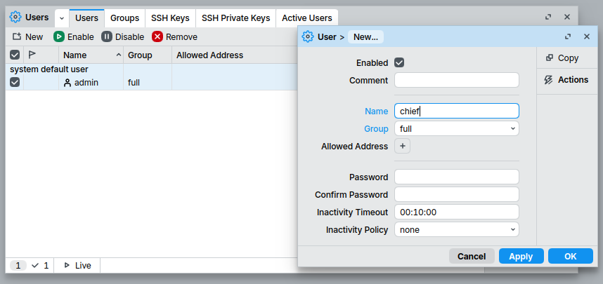
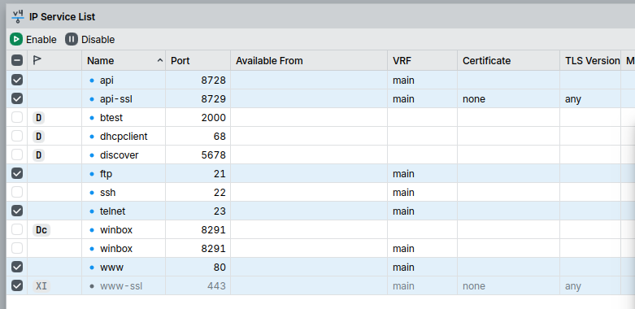
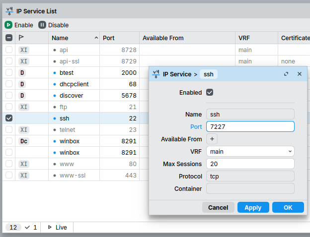
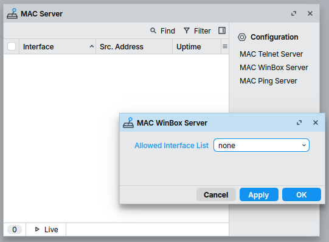
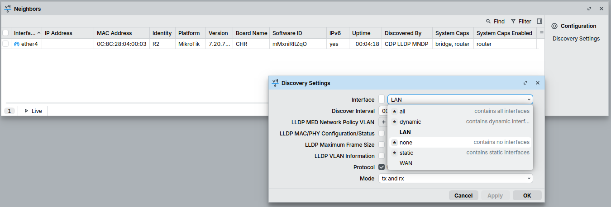
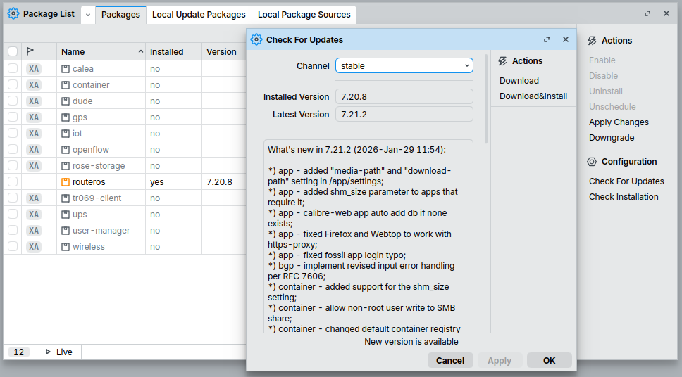

+++
date = '2026-02-03T15:52:29+01:00'
modified = '2026-02-21T14:04:35+01:00'
draft = false
title = 'Securing RouterOS'
tags = ["MikroTik"]
summary = "In this post I show how to improve security of MikroTik's devices by hardening the default configuration."
+++

In this post I will be talking about some basic security precautions for a Mikrotik device running RouterOS. There are a few things I am assuming here:

- The device is either a router or a multilayer switch (at least it is intended to be used in that role).
- It may or may not have a WiFi transceiver built-in.
- RouterOS is from the v7 line.
- You have successfully connected to the device using WinBox on the Ethernet port.
- When setting up the device you either accepted the default configuration (in many cases a good starting point) or ... you know your onions and you just want to check if you haven't forgot about some details.

With that out of the way, let's get on with it.

## First steps

You should secure your device BEFORE connecting it to a broader network. For the default configuration it means you should UNPLUG the cable from the WAN port if it's plugged in.

Also if the device has a built-in WiFi module you should, for now, disable its interfaces:

- In Winbox
  - WiFi
  - mark all active interfaces on the Interface tab and disable them
- In the CLI:
  `/interface/wifi/disable [find where disabled=no]`

We are not going to bring them back on until the very last step.

## New, non-standard admin account

The first things worth doing is to create a new user account with full privileges and strong password. It should have a name not related to its real function. Then the default admin account should be removed. This mitigates simple brute force attacks working on the off-chance of finding poorly secured device - you cannot start braking the password unless you know the login.

The default credentials can be found on stickers both outside and inside the device itself (you didn't know that, did you?) as well as in paper documents shipped with it so you can go back to it simply doing a hard reset.

To prevent locking yourself out, first create a new user account (belonging to the 'full' group) and try connecting using these new credentials. Only if that succeeds remove the old admin account.
To do this:

- WinBox:
  - to add user:
    - System->Users->New
    - Required fields are:
      - Name
      - Group (**set this to `full`**)
      - Password
      - Confirm Password
  - to remove user:
    - System->Users
    - Select and entry and click Remove
- CLI:
  - to add user:
    - `/user/add name=your_login_name_here group=full password=password_goes_here
    - This command will not be saved in terminal's history and the line will also disappear from the terminal screen as soon as you hit enter.
  - to remove user:
    - `/user/remove login_name`



It should go without saying that the password for this new user should be at least as strong as the factory one. Good options are:

- random string of letters and numbers
- a mnemonic password (https://xkcd.com/936/)

## WiFi password (optional)

If the device has WiFi changing the default password aka WiFi key aka WiFi passphrase is a good idea. The factory passphrase is ok to use... but since we are at it:

- Winbox
  - WiFi->choose interface and double click it.
  - In a new window choose the Security tab.
  - Look for and change the content of the Passphrase option and hit apply.
- CLI
  - to list: `/interface/wifi/print`
  - to disable: `/interface/wifi/set name_of_the_interface security.passphrase=new_password_for_you_WiFi`

If you have more then one WiFi interface you will have to repeat the above procedure for all of them.

## Switching off unused services

There are a few services running on the device, some of those are used to access the device, some provide extra functionality. You will find many of them in the Services menu. Unless you have reasons you should switch off any service you are not planning to use. Potential software vulnerabilities are just increasing attack surface.
Some good candidates for disabling are:

- api (both normal and encrypted)
- ftp
- telnet (you really should be using ssh anyway)
- www (both normal and encrypted)

In Winbox:

- IP -> Services
- mark unwanted ones and disable them
  In CLI:
- to list: `/ip/service/print`
- to disable: `/ip/service/disable name_of_the_service`



Except for the above you may also see some dynamic entries in the list that can't be disabled from from the `/ip/service/` CLI menu or the IP Services List in WinBox. These are most likely:

- btest
- dhcp
- dhcpclient
- discover

The `btest` entry is a sign of the enabled bandwidth test server. There is no reason to have it running at all times, it is useful only for the duration of the tests. To turn it of:

- in WinBox:
  - Tools->BTest Server
  - uncheck the `enabled` option and hit Apply or OK.
- in the CLI:
  - `/tool/bandwidth-server/set enabled=no`

The `dhcp` showing in the list means the dhcpserver is running, most likely on the LAN ports if you started with the default configuration.
The `dhcpclient` indicates a client for dhcp protocol is trying to obtain configuration for some ports. Again if you started from default configuration this would be running on WAN (likely ether1).
If you started from defaults and don't plan a more advanced configuration, in which case you already now what to do, you should keep those services running.

The `discover` entry is present if MNDP is enabled. Read on to learn what it does and whether and how to disable it.

## Hardening access

### SSH

You obviously should leave some methods of configuring and monitoring the device accessible. It is best to keep both ssh and WinBox enabled. The later option is also responsible for connectivity with MikroTik's control application for smartphones and a monitoring software called The Dude so that is something worth considering.

For similar reason we created a user account with non standard name, you should change the default listening port of the SSH service to something other then `22`. This really is only useful against some wannabe hackers and automated attacks concentrating on well known port numbers but it is easy to do and won't hurt.
Some other time I will write about truly secure method of accessing the device through ssh using modern day best practices but for non-critical systems, methods shown in this post should be plenty enough.



### Winbox

When it comes to WinBox the situation complicates. There are two methods WinBox can establish connection with a device. The first one is a TCP session, the second one is UDP on layer 2 only and is using so called MAC server. Even if you disable TCP connectivity in the IP Service menu it will not turn off the method using MAC addresses. Of course username and password are still required. The same MAC server that allows WinBox to connect also allows for so called MAC telnet connections.
This layer 2 connectivity is a very useful thing, especially when setting up a new device or making deep changes in configuration. Sometimes you may accidentally cut off your access to the device by making a mistake in settings and then regaining it is often only possible thanks to the MAC Server running (other option is a hard reset and starting from scratch). The broad access is however a problem.
Before making the change show below make sure your device has and IP address and that your are logged in using the TCP method. If you are logged in you can see the address of the device in the status bar on the bottom of the WinBox window - it should be an IP address not MAC. You can also print active logins from CLI `/user/active/print` to see if your are connecting using your IP or your MAC. When starting WinBox session you should have provided an IP address in "Connect to" in field, not the MAC.

To completely turn off MAC server:

- Using WinBox:
  - Tools -> MAC Server
  - Chose the MAC Telnet Server first and set Allowed Interfaces List to `none`
  - To the same with the MAC WinBox Server
  - To the same with the MAC Ping Server
- Using CLI:
  - MAC Telnet : `/tool/mac-server/set allowed-interface-list=none`
  - MAC WinBox Server: `/tool/mac-server/mac-winbox/set allowed-interface-list=none`
  - MAC Ping Server : `/tool/mac-server/ping/set enabled=no`



There is a way to keep this useful service on while restricting access to a defined list of trusted interfaces. Default configuration comes with two interface list WAN and LAN. It may be tempting to use the later and although it is not entirely bad idea, LAN may still include connections from devices and people you don't trust. For that reason its best to have a separate trusted interface for management purposes only. This however is beyond the scope of this post.

One other method of restricting access to the MAC server is by using appropriate firewall rules, read on.

## Other services

First and foremost it is important to mention the IPv6 protocol. If you know what it is and why you want to keep it, you should probably make better use of your time and stop reading this post. If you don't then in 99.9% of cases you should turn IPv6 support off. To that:

- in WinBox:
  - IPv6->Settings
  - check the `Disable IPv6` box and hit Apply or OK.
- in the CLI:
  - `/ipv6/settings/set disable-ipv6=yes`

In WinBox you may be prompted to reboot the device. In the CLI check the status of IPv6 with `/ipv6/settings/print` command.

There are many other services that can be running but are disabled by default like: Media server, SMB file sharing, webproxy, TFTP server and so on. Among them there is one you should be aware of - the Cloud.

Cloud is a set of features rather then a standalone service. These allow you to e.g. establish a secure connection to your device from the internet using MikroTik's relay servers or backup device configuration on MikroTik's cloud servers, etc. (see the docs). Most of them are not active unless configured.
The one that is on is the system clock update service. This is a separate thing from the NTP protocol and only allows for rough (with a precision of a few seconds) adjustments of system time and automatic time zone configuration based on public IP address of your device. It should not be an issue and it is probably safe to keep. In case you wanted to turn if off go to:

- Using WinBox:
  - IP -> Cloud
  - Look for Update Time option and uncheck it
- Using CLI:
  - `/up/cloud/print`
  - `/up/cloud/set update-time=no`

## Firewall

Setting up a firewall to protect your device and network is a huge topic. It is also something that may not be relevant for your use case e.g. you are building a larger network and plan to have a separate appliance for this purpose, or have it in the cloud or perhaps you are just setting up a switch or an AP.

For above reasons I will cover firewall configuration (to some extent) in future posts. For now, if you are using the default configuration and need a firewall, the default rule set should be sufficient.

Also if you kept the IPv6 support on, make sure you have IPv6 firewall rules in place. Fortunately default configuration comes with those as wel. To double check this is the case look in th IPv6/firewall menu (not the IP/firewall which is of IPv4).

## Turning off neighbor discovery

MikroTik devices use a mixture of layer 2 and layer 3 discovery protocols to detect other network equipment connected directly to their ports and to exchange information about their configuration. By default RouterOS is configured to send, every 30 seconds, its own configuration details on all of its ports using 3 protocols:

- [CDP](https://en.wikipedia.org/wiki/Cisco_Discovery_Protocol) (Cisco Discovery Protocol)
- [LLDP](https://en.wikipedia.org/wiki/Link_Layer_Discovery_Protocol) (Link Layer Discovery Protocol)
- [MNDP](https://help.mikrotik.com/docs/spaces/ROS/pages/24805517/Neighbor+discovery) (MikroTik Neighbor Discovery Protocol)
  This is the service that is showing as `discover` in the IP Services menu.

The information about connected neighbors and their capabilities is very useful to understand network topology and to diagnose connectivity issues.
The downside is that quite a lot is being revealed and that information can potentially be used by bad actors e.g. sending out the information about software version the device is using to everyone that happens to listen is not a particularly good idea and if the device is also transmitting on WiFi interfaces the idea is even worse (BTW that is one of the reasons we turned them off).

You can configure on which interfaces these protocols are allowed to operate and to some extent what information is being sent:

- In WinBox: IP->Neighbors-> Discovery Settings
- Through CLI: `/ip/neighbor/discovery-settings/`



For small enough networks it is probably best to disallow discovery completely by setting Interfaces option to an empty interfaces list called `none` (warning, read to the end of this paragraph before making that change):

```
/ip/neighbor/discovery-settings/set discover-interface-list=none
```

Alternatively one can define a list of interfaces on which discovery protocols should work (in the `/interface/list/` submenu) and than use that instead. Explicitly allowing known ports helps avoid side effects.

When you disable neighbor discovery WinBox app will not be able to detect devices - hitting the refresh button will have no effect. Your device is still accessible though but YOU MUST know the address (either IPv4 or IPv6 or MAC depending on which of those you kept on). So it's important to configure discovery but:

- do know where to connect to before disabling it (and if you have a choice IP connection is more stable and is better to use then the MAC counterpart).
- bear in mind that this alone is not a security mechanism, access is possible it's just not announced.

## Removing packages

All functionality of RouterOS comes in the form of specialised software packages that can be downloaded and installed on the device. The core package, `routeros`, cannot be removed or disabled but if there is something installed that you know you will not (or no longer) use - remove it. To check the list of installed packages do:

- Using WinBox:
  - System -> Packages
- Using CLI:
  - `/system/package/print`

## Updating software and firmware

When your device is somehow secured it is a good time to do software update. Go ahead and connect to the internet (reconnect the WAN port).

Be aware that MikroTik devices have two separate components that can be updated. They are referred to as software and firmware. Updating the software is essentially updating the operating system - the RouterOS itself together with any extra packages you have installed. Firmware on the other hand is the low level code responsible for booting the device and some other functions - computer's BIOS would be a good analogy here.

To update the software:

- Using WinBox:
  - System -> Packages
  - Click Check For Updates
  - A new window will appear in which you will be able to chose what updates channel you want to use. I recommend the stable or long-term channel as others should only be used for experimentation.
  - If there is a new version available use the Download&Install option to update and automatically reboot the device
- Using CLI:
  - `/system/package/update/check-for-updates`



You can update from a locally stored image, e.g. you downloaded using a your computer. Check current MikroTik's documentation for the exact procedure.

To update the firmware component you need to use a different menu. New firmware, if available, is downloaded when you check for the software updates, so in the procedure below you can only decide to install it or not, there is no separate option of checking for updates.

- Using WinBox:
  - System -> RouterBOARD
  - Check is the new firmware is available
  - Click upgrade
- Using CLI:
  - `/system/routerboard/print`
  - `/system/routerboard/upgrade`

Note that RouterOS can be installed on other devices, even normal computers, so if you are not using a device made by MikroTik this menu will not be present.

> [!WARNING]
> Although MikroTik devices have a backup firmware image and they will default to it if the upgrade process fails, be sure you are not doing the upgrade in midst of some power outages as you are risking bricking your device.

## Finally

If you turned it off you can put WiFi back on.
